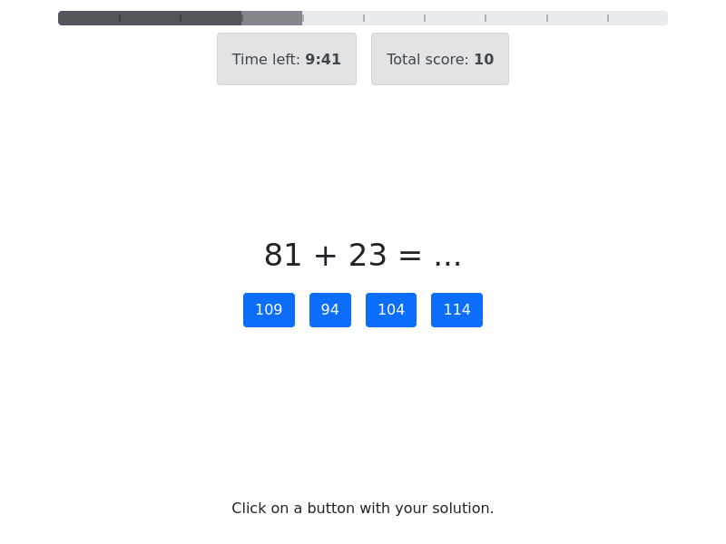

# Proto app of trials with choices

The app runs series of math tasks. Player should select correct answers from provided options.
Condition for each player determines if numbers in the expressions are all odd, even or mixed.

The game is limited in number of trials and page timeout.

## Workflow

- predefined number of random trials are generated on session creation along with answer options for each trials
- the trials are sequentially displayed to a player
- player responds with their answer choosen from provided options
- answers are not saved to server and not validated
- the page immediately advances to next trial
- answers are evaluated when all series complete

## Interface

- player gives response by pressing a button with an answer
- overall progress is indicated by nice animated progress bar

## Features

- trials are generated randomly and embedded into page
- responses are collected and passed through a hidden form field
- all data is recorded for each trial
- when player reloades page all the data is lost and series restart
