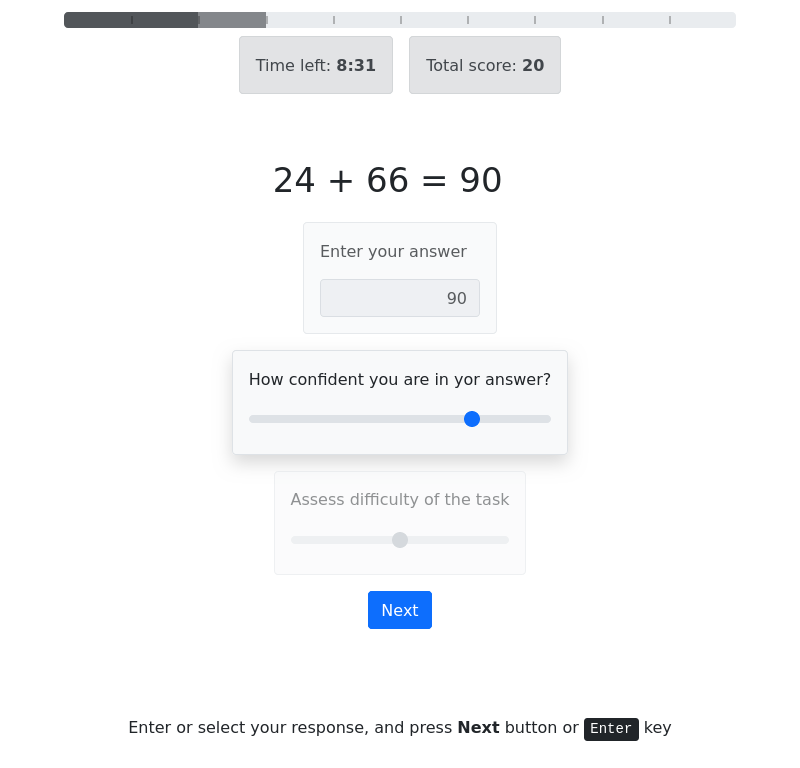

# Proto app of trials with multiple stages

The app runs series of math tasks. Player should calculate expressions and respond with correct answers.
In addition player is asked questions abut the task.
Condition for each player determines if numbers in the expressions are all odd, even or mixed.

The game is limited in number of trials, allowed number of failures, and page timeout.

## Workflow

- predefined number of random trials are generated on session creation
- the trials are sequentially displayed to a player
- each trial consists of 3 steps:
  - entering answer into text field
  - answering a question on a slider input
  - answering another question on a slider input
- stages are advanced when a player pressed Enter or 'Next' button,
  the advancing is blocked until player actually respond
- all the responses are send to server
- the answer is validated and feedback is given
- score is assigned for each correct or incorrect answer
- then page iterates to next trial

## Features

- pregenerating trials randomly
- recording status, question, answer and response time for each trial
- switching stages in a nice smooth manner
- stages are advanced when a player pressed Enter or 'Next' button
- blocking 'submit' button and 'enter' key until player actually gives some input
- showing giving answer inside task text, so its clearly visible in all stages
- indicating validity of an answer or timeout by highlighting answer
- showing feedback with resulting score for each trial
- displaying progress bar indicating number of completed trials and current iteration
- detecting page reload or navigating back and immediately terminating the series
