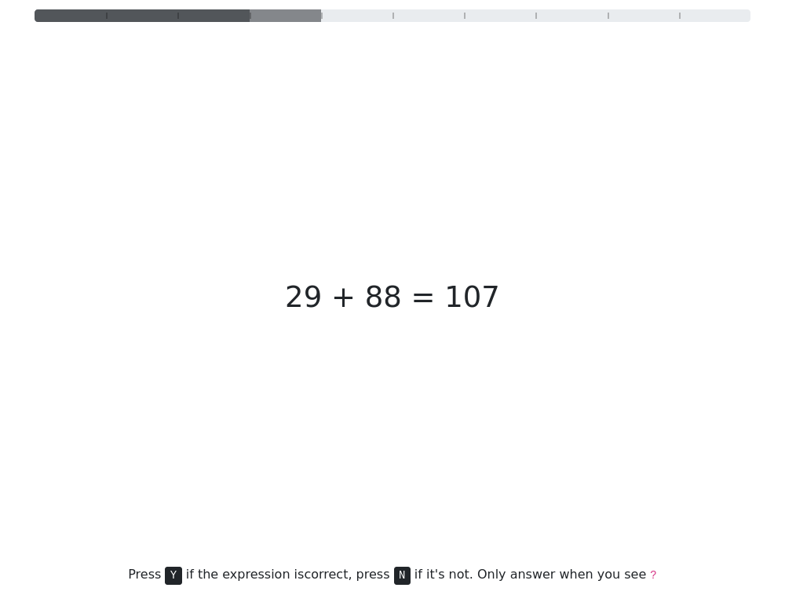

# Proto app of trials with scheduled phases

The app runs series of math tasks. Player should decide if shown equations are correct or not.
Condition for each player determines if numbers in the expressions are all odd, even or mixed.

The game is limited in number of trials, allowed number of failures, and page timeout.
Player is limited in time to solve each task.

## Workflow

- predefined number of random trials are generated on session creation
- trials are sequentially displayed
- each trial consists of 3 timed phases:
  - focusing phase
  - stimulus phase, with task equation
  - response phase, when player responds
- the answer is validated on server and feedback is given
- score is assigned for each correct or incorrect answer, and for timed out trials
- then page iterates to next trial

## Interface

- phases are indicated by symbols in the middle of the page
- player gives response by pressing 'Y' or 'N'
- validity of an answer and timeout is indicated symbol in the middle
- overall progress is indicated by nice animated progress bar
- feedback is shown with resulting score for each trial

## Features

- trials are generated randomly
- response time is measured
- all data is recorded for each trial
- series are terminated when player reloades page or navigates back/forth