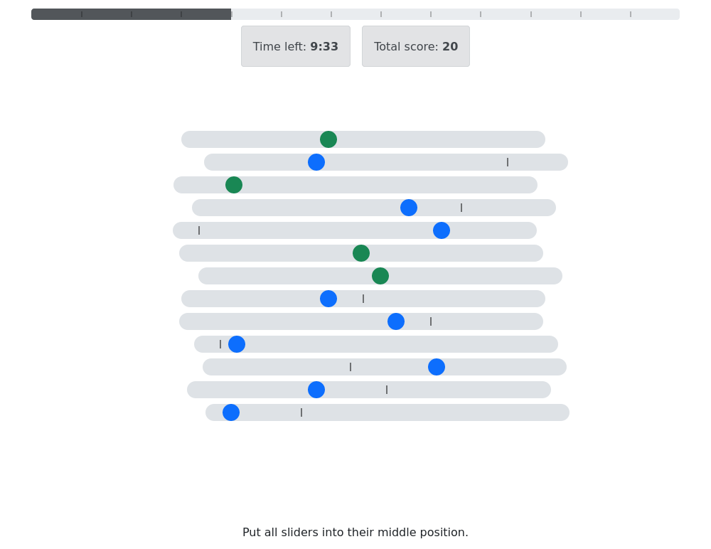

# Proto app of sliders task

The app runs classic sliders task.
Player should move handles of all sliders in their target positions.

The game is limited by page timeout.

## Workflow

- predefined number of random sliders are generated on session creation
- all the sliders are displayed to a player
- player moves handles of the sliders
- each move is immediately evaluated on server
- score is assigned for each move

## Interface

- target position of each slider is indicated by a tick
- validity of each slider is indicated by color of the handle
- player can move slider from away from target position
- overall progress is indicated by a progress bar

## Features

- sliders are generated with random target and initial positions and a random visual shift
- state of each slider is saved on every move
- when player reloades page aliders restore their state