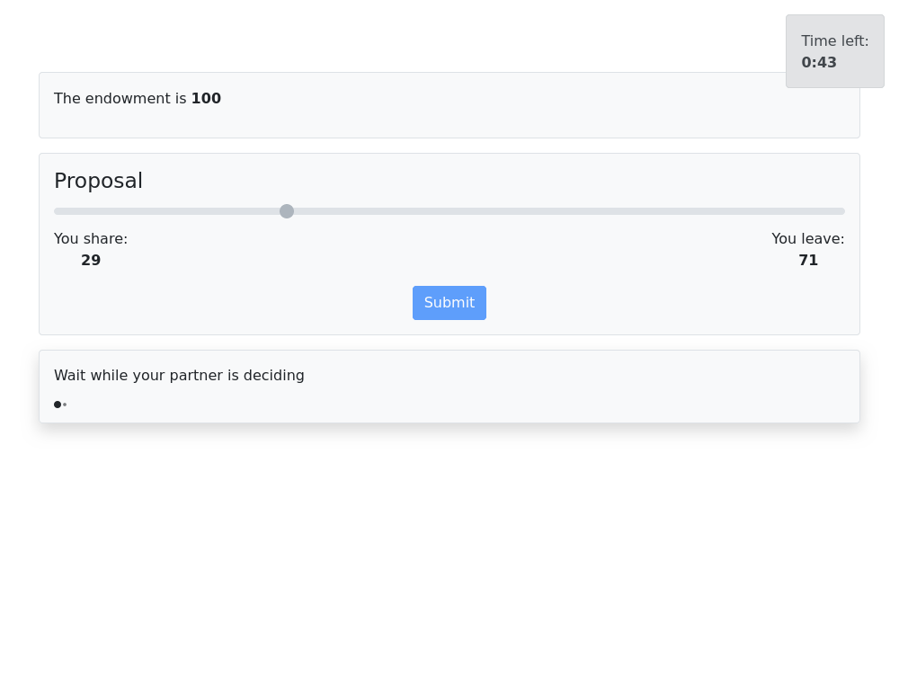

# Proto app for ultimatum game

The app implements classic ultimatum game with Proposer and Receiver.
It also reveals age and gender of players.

The game is limited by time.

## Workflow

- Participants firstly pass through separate screener app before get grouped into the game.
- Players then see brief and their age and gender are revealed to each other.
- Then they run sequential stages of game:
  - Proposer selects how much to share
  - Receiver selects whether accept or reject
  - Players see outcome of the game
- Experiment terminates if a player abandons the game.

## Interface

- All stages run on a single live page with smooth transitions.
- Players select their and then explicitely submit their responses.
- Response time is measured from the beginning of a corresponding stage until the response is submitted.

## Features

- Players are grouped as they arrive from the screener app.
- Some player data is copied from the screener app.
- The main page detects if a player abandons the game, the group is marked 'dropped' and the experiment terminates on special termination page.
